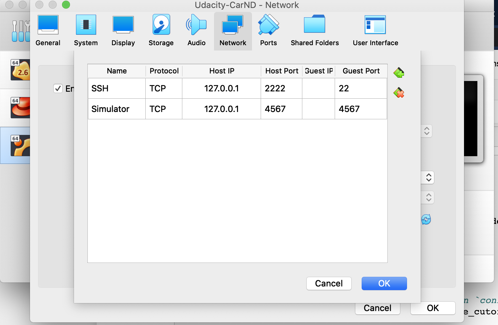
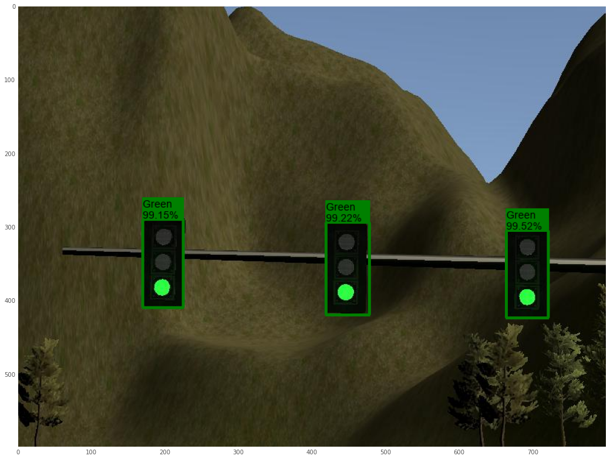
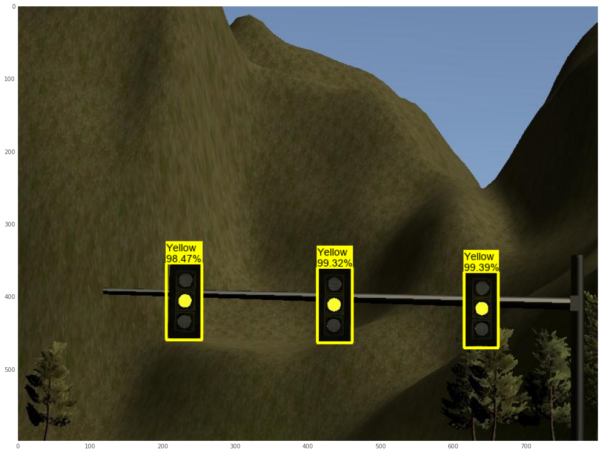
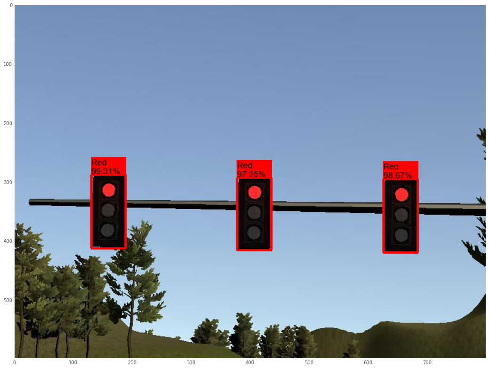
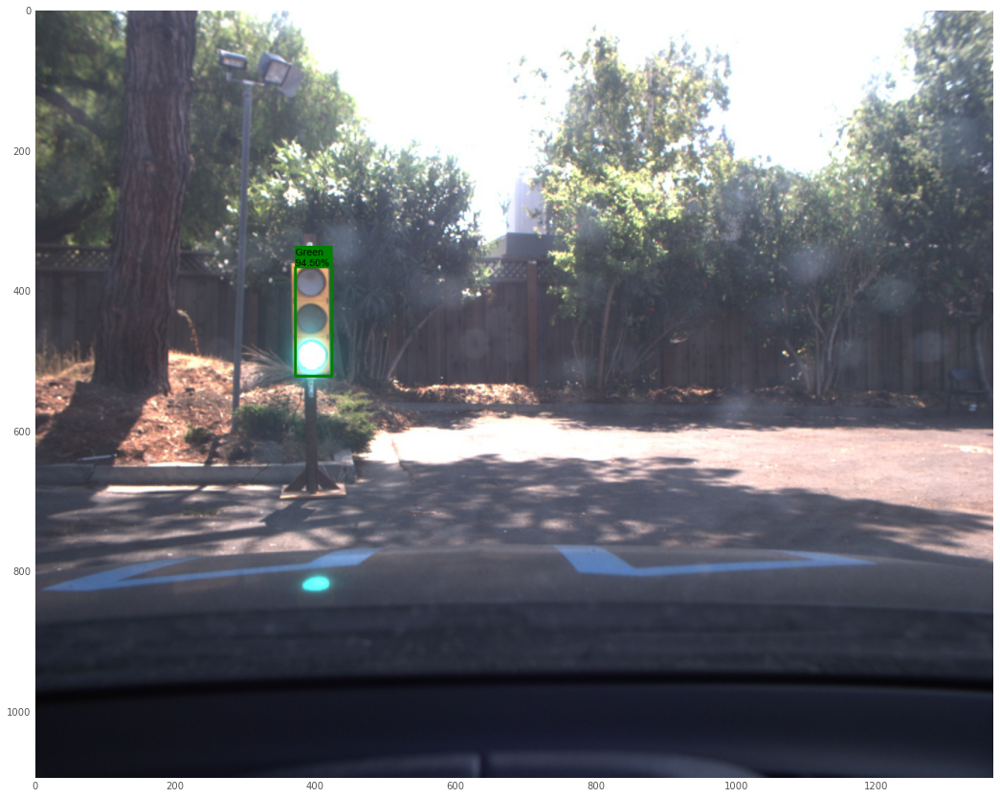
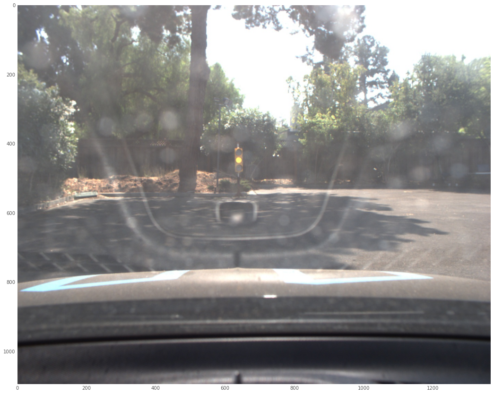
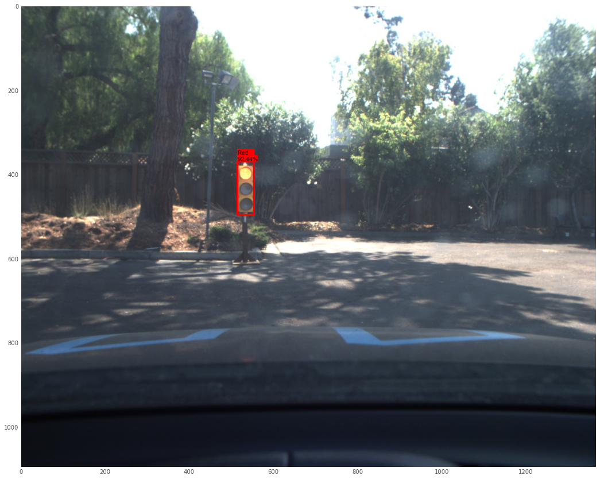
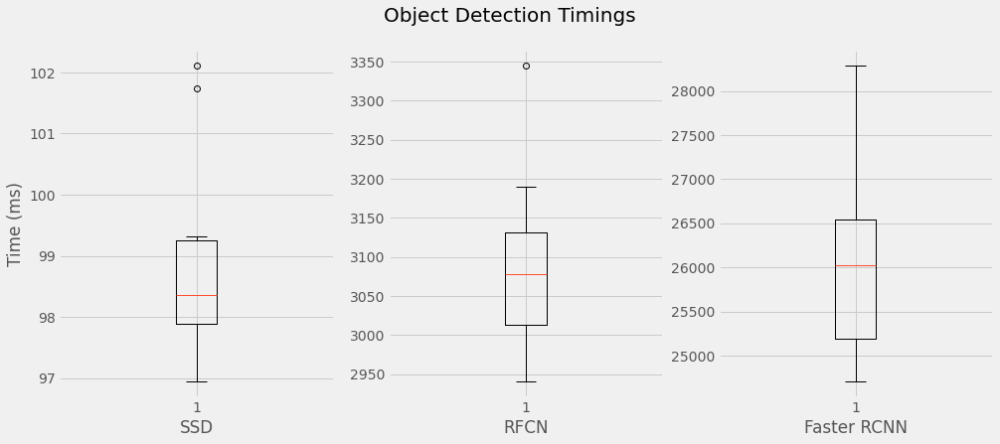

# Self-driving Car Capstone Project

This project is the final project of the Udacity Self-Driving Car Nanodegree: Programming a Real Self-Driving Car. 

---

## ROS Instrattion
Please use **one** of the two installation options, either native **or** docker installation.
I used ubuntu 16.04 VM on VirtualBox on my Macbook Pro 2018. It worked fine when allocating 4 CPUs and 8GB memory for test drive without object detection. For simulation with traffic light detection, I used a workspace provided by Udacity as the local VM did not perform enough for the traffic light detector to return the prediction on real-time. Note that a warm-up is required for the detector at first, so please wait for a few seconds before starting the simulation after the camera is on.
Please refer to the recording here: https://drive.google.com/file/d/1KzjDNZ-b_slqbz9UUl-67G6UAm381euG/view?usp=sharing

### Native Installation

* Be sure that your workstation is running Ubuntu 16.04 Xenial Xerus or Ubuntu 14.04 Trusty Tahir. [Ubuntu downloads can be found here](https://www.ubuntu.com/download/desktop).
* If using a Virtual Machine to install Ubuntu, use the following configuration as minimum:
  * 6 CPU
  * 16 GB system memory
  * 25 GB of free hard drive space

  The Udacity provided virtual machine has ROS and Dataspeed DBW already installed, so you can skip the next two steps if you are using this.

* Follow these instructions to install ROS
  * [ROS Kinetic](http://wiki.ros.org/kinetic/Installation/Ubuntu) if you have Ubuntu 16.04.
  * [ROS Indigo](http://wiki.ros.org/indigo/Installation/Ubuntu) if you have Ubuntu 14.04.
* Download the [Udacity Simulator](https://github.com/udacity/CarND-Capstone/releases).

### Docker Installation
[Install Docker](https://docs.docker.com/engine/installation/)

Build the docker container
```bash
docker build . -t capstone
```

Run the docker file
```bash
docker run -p 4567:4567 -v $PWD:/capstone -v /tmp/log:/root/.ros/ --rm -it capstone
```

### Port Forwarding
To set up port forwarding, please refer to the "uWebSocketIO Starter Guide".
When using VirtualBox, it can be setup in Settings > Network > Advanced > Port Forwarding


port 4567 is for this purpose and port 2222:22 is for ssh.

## Build and Run Instruction

1. Clone the project repository
```bash
git clone https://github.com/yuki678/CarND-Capstone.git
```

2. Install python dependencies
```bash
cd CarND-Capstone
pip install -r requirements.txt
```

3. Download pretrained models for traffic light detection
```
cd ros/src/tl_detector/light_classification/
mkdir model_trained && cd model_trained
cp [downloaded models]
cd [back to top directory for CarND-Capstone repo]
```
The trained models are available [here](https://drive.google.com/drive/folders/1_rf08IpmdFSbopUAv-2JiKQ3GZp6otI0?usp=sharing). There are two models, one for simulator and the other for real world testing. The repo is configured for simulator.
 * faster_rcnn_resnet101_coco_inference_graph_sim.pb for simulator
 * faster_rcnn_resnet101_coco_inference_graph_site.pb for real world testing

4. Make and run styx
```bash
cd ros
catkin_make
source devel/setup.sh
roslaunch launch/styx.launch
```
5. Run the simulator
 * When the simulator starts, please tick camera on and wait for a few seconds to allow the detector warm up and tick manual off when you start seeing the log output for the traffic light prediction.

## Real World Testing
1. Update `ros/src/tl_detector/tl_detector.py` as follows:
 * `CLF_NAME` - faster_rcnn_resnet101_coco_inference_graph_site.pb
 * You can comment out line 17 and uncomment line 18

2. Make
```bash
cd ros
catkin_make
source devel/setup.sh
```

3. Download [training bag](https://s3-us-west-1.amazonaws.com/udacity-selfdrivingcar/traffic_light_bag_file.zip) that was recorded on the Udacity self-driving car.

4. Unzip the file
```bash
unzip traffic_light_bag_file.zip
```
5. Play the bag file
```bash
rosbag play -l traffic_light_bag_file/traffic_light_training.bag
```
6. Launch your project in site mode
```bash
cd CarND-Capstone/ros
roslaunch launch/site.launch
```
7. Confirm that traffic light detection works on real life images

### Other library/driver information
Outside of `requirements.txt`, here is information on other driver/library versions used in the simulator and Carla:

Specific to these libraries, the simulator grader and Carla use the following:

|        | Simulator | Carla  |
| :-----------: |:-------------:| :-----:|
| Nvidia driver | 384.130 | 384.130 |
| CUDA | 8.0.61 | 8.0.61 |
| cuDNN | 6.0.21 | 6.0.21 |
| TensorRT | N/A | N/A |
| OpenCV | 3.2.0-dev | 2.4.8 |
| OpenMP | N/A | N/A |

---

## Project Overview
The following diagram shows the ROS nodes and topics between those nodes in the project.


## Project Steps

### Waypoint Updater #1
I first implemented `waypoint_updater.py`. At this stage, just added initialization and call back functions for each subscribers and confirmed it can publish waypoints ahead of the car to follow.
As controllers and object detections were not implemented.


### DBW Node
Then, I implemented Drive-By-Wire node and controllers. Under `twist_controller`, `dbw_node.py` was updated to use Controller from `twist_controller.py` to controll the vehicle's throttle, brake and steering.
`twist_controller.py` uses yaw_controller for steering angle and pid controller for throttle rate. Apply brakes (torque, N/m) to stop the vehicle within the range of deceleration as `abs(decel) * vehicle_mass * wheel_radius`.

Note that the simulator shows mph but all the calculations are in metric unit.

### Traffic Light Detection #1
Next, I worked on traffict light detector node. Soon I realised it would take a lot of time to build and train an object detection model. Thus, first implement `tl_detector.py` in test mode without actual real-time prediction. The test mode uses the label provided along with camera images. 


### Waypoint Updater #2
Now, going back to the waypoint updater to consider `/traffic_waypoint` topic with the callback of `traffic_cb` function.
Adjust the target velocity for the waypoints when there is a red traffic light, when the traffic light in front of the vehicle is red in three consecutive images. The updated waypoints consider the deleration to stop the vehicle smoothly right before the stop line.

### Traffic Light Detection #2
Lastly, I implemented the traffic light detection in the following way.
#### 1. Build an object detection model.
Check the GitHub repo provided by Udacity, [https://github.com/udacity/CarND-Object-Detection-Lab](https://github.com/udacity/CarND-Object-Detection-Lab).
Note that Model Zoo was updated and links are not correct in the README in the above repo.

#### 2. Setup tensorflow models to use Object Detection API
Clone tensorflow model repo, https://github.com/tensorflow/models/. I referred to this blog post to setup the tool and perform the object detection: [Step by Step TensorFlow Object Detection API Tutorial](https://medium.com/@WuStangDan/step-by-step-tensorflow-object-detection-api-tutorial-part-1-selecting-a-model-a02b6aabe39e)
This post has five sections to cover all processes and good to follow, while is a bit out dated.

I used the faster rcnn model, pretrained on CoCo dataset because of facing some difficulty on version compatibility, espicially because of tensorflow version 2 compatibility to tensorflor v1.3 in the Udacity workspace.
This blog post provided nice conversion of models trained later version of tensorflow 1.x to v1.3: https://github.com/marcomarasca/SDCND-Traffic-Light-Detection#Converting-for-Tensorflow-13

One I will try later is to use other pretrained models on Model Zoo - [Open Model Zoo GitHub Repo](https://github.com/openvinotoolkit/open_model_zoo) and decide which models to use.

#### 3. Perform the transfer learning / fine tuning
Following the previous blog post, setup and train the model as
 - prepare simulator dataset
 - prepare real site dataset
 - replace the last layer to four output - Green Traffic Light, Yellow Traffic Light, Red Traffic Light, None.
 - train the model on simulator dataset (this is for simulator)
 - train the model on real site dataset (this is for real world testing)

This time, I tried to detect and classify the traffic light with colors as it was simple to implement, but not so efficient architecture.
Later, I will try to first detect the areas of interest for a traffic light, then apply classification of green/yellow/red for the detected areas.
The efficiency and the accuracy have to be balanced carefully as autonomous driving car requires realtime - at least less than 50ms to predict an image from the camera.

#### 4. Deploy the model
Saving the checkpoint model as .pb file - frozen inference graph.
Updated `tf_classifier.py` and `tf_detector.py` to use the trained model to use the model to predict if there is a red traffic light in front of the vehicle from camera images in realtime.

#### 5. Make sure it performs!
I was using a local VM on my laptop (Macbook Pro 2018) but the time required for one prediction was around 2000ms (2s!) and obviously could not catch up the images sent from camera.
Just managed to perform just enough on Udacity Workspace, but learned how important to consider the balance between model performance and accuracy.
Also, struggled on version compatibility issues, espicially between old udacity tensorflow v1.3 env and current tensorflow v2...

Here are some images annotated by the trained model. It is easier to predict on simulator images, while it sometimes fails to detect the traffic light in real world images due to noises.








As in the Object Detection project, I tested the performance of three trained models 
* SSD
* RFCN
* Faster RCNN

As can be seen, SSD is only option in my local env, which is still a bit too slow to use in real time.

